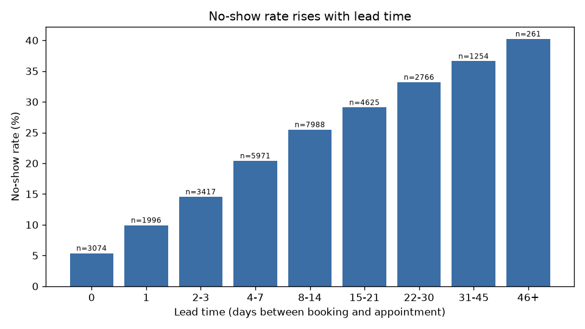
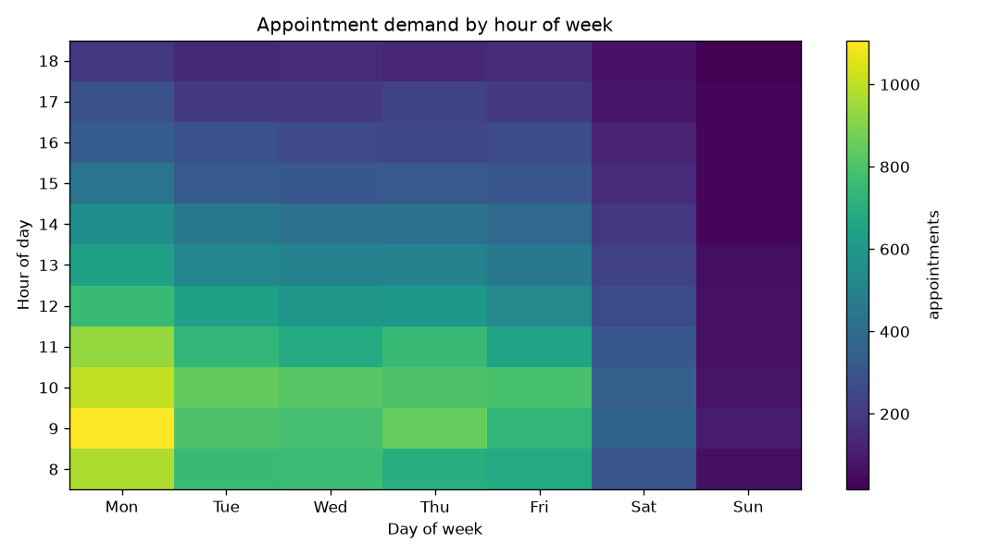
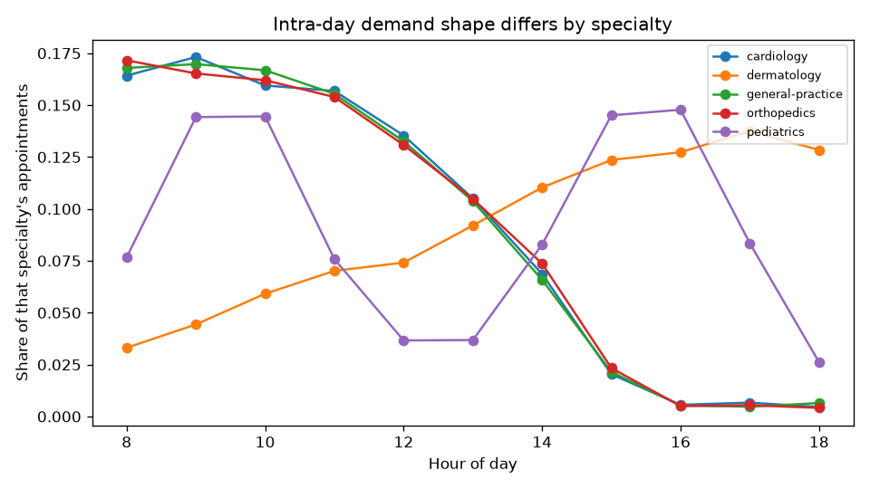

# Phase 1 — Database

> **Goal:** a schema where the important rules are enforced by PostgreSQL rather
> than hoped for by application code, plus synthetic data that contains
> *genuinely learnable* structure — proven, not asserted.
>
> **The gate:** Phase 1 is not finished when the tables exist. It is finished
> when `scripts/validate_data.py` passes. If the intended correlations are not
> measurably present in the generated rows, the generator is wrong, and every ML
> metric downstream would be meaningless.

---

## Table of contents

1. [Normalization, and the one deliberate exception](#1-normalization-and-the-one-deliberate-exception)
2. [Representing time](#2-representing-time)
3. [Constraints that do real work](#3-constraints-that-do-real-work)
4. [The exclusion constraint](#4-the-exclusion-constraint)
5. [ON DELETE is a design decision](#5-on-delete-is-a-design-decision)
6. [Native ENUMs](#6-native-enums)
7. [Generated columns](#7-generated-columns)
8. [Indexes, and measuring one honestly](#8-indexes-and-measuring-one-honestly)
9. [The PL/pgSQL trigger](#9-the-plpgsql-trigger)
10. [Schema separation for analytical tables](#10-schema-separation-for-analytical-tables)
11. [Migrations as a narrative](#11-migrations-as-a-narrative)
12. [Testing a database](#12-testing-a-database)
13. [Synthetic data with learnable structure](#13-synthetic-data-with-learnable-structure)
14. [The validation gate](#14-the-validation-gate)
15. [Results](#15-results)

---

## 1. Normalization, and the one deliberate exception

### Concept: normal forms

**1NF** — no repeating groups; every cell holds one value.
**2NF** — no non-key column depends on only *part* of a composite key.
**3NF** — no non-key column depends on another non-key column.

The usual summary: *every non-key column depends on the key, the whole key, and
nothing but the key.*

The point is not tidiness, it is that redundancy creates the possibility of
**contradiction**. If a doctor's specialty were stored on every appointment row
as text, updating it would mean updating thousands of rows, and any missed row
becomes a row that disagrees with the others. There is then no fact of the
matter about what the specialty is.

### Where this schema is normalized

- `Doctor ↔ Specialty` is many-to-many through **`doctor_specialty`**. A text
  column could not represent a cardiologist who also practises internal
  medicine, and would make "who can take this appointment?" a string match with
  typos indistinguishable from real values.
- **`Availability` is its own table.** Columns like `monday_start` /
  `monday_end` would cap a doctor at one window per day, which cannot express
  the most ordinary schedule there is: 09:00–12:30 and 13:30–19:00.
  That gap between windows is also how **mandatory breaks** are represented, so
  the optimizer gets break handling from the same constraint that keeps
  appointments inside availability — no extra table, no special case.
- **A patient's historical no-show rate is not stored.** It is a model feature,
  but caching it would create a value that goes stale on every appointment
  outcome. Phase 3 computes it from history.

### The one deliberate denormalization

`appointment.specialty_id` duplicates something derivable at booking time by
joining `appointment → doctor → doctor_specialty → specialty`. It is stored
anyway, for two reasons:

1. **Read performance.** Slicing appointments by specialty is the hottest read
   path in the system — demand forecasting groups by `(specialty, date, hour)`
   and every dashboard filters on it. Without the column, each of those queries
   needs a two-hop join through a junction table, on the largest table in the
   schema.
2. **Historical accuracy.** It records the specialty *as of booking time*. A
   doctor who later adds or drops a specialty would otherwise rewrite the
   meaning of every past appointment, and the forecasting models would train on
   a history that never happened.

The usual cost of denormalization is drift — the copy disagreeing with the
source. Here divergence is the *intended semantics*: this column is a snapshot,
not a mirror. That is what makes this denormalization defensible rather than
merely convenient.

---

## 2. Representing time

The single most consequential modelling choice in the schema.

```sql
appointment_date DATE,
start_time       TIME,
end_time         TIME
```

Not a `timestamptz`. Three reasons:

**Wall-clock semantics are correct for a clinic.** A 09:00 slot is 09:00 to the
staff and the patient on both sides of a daylight-saving change. Storing an
absolute instant would silently shift the whole day's schedule by an hour twice
a year.

**The required index needs a date column.** `(doctor_id, appointment_date)` has
to index a real column. Deriving a date from a `timestamptz` requires a timezone
conversion, and `timestamptz AT TIME ZONE 'x'` is `STABLE`, not `IMMUTABLE`, so
it cannot be used in a generated column or an index expression.

**The exclusion constraint needs an immutable expression.**
`appointment_date + start_time` is `date + time → timestamp`, which *is*
`IMMUTABLE` and therefore legal inside an index. This is what makes §4 possible
at all.

**The limitation, stated plainly:** the model assumes one clinic-local timezone
per clinic and cannot represent an appointment spanning midnight. Neither is a
real constraint for outpatient scheduling, and the `clinic.timezone` column
exists for display and for converting to absolute time when something outside
the clinic needs it.

---

## 3. Constraints that do real work

### Concept: CHECK constraints

A CHECK is a row-level predicate the database enforces on every write. Its value
is that it holds for **every writer** — the ORM, a Celery task, a bulk load, a
migration, and an operator typing into `psql`. Validation in application code
only holds for traffic that goes through the application.

The schema has 19 CHECK constraints. Representative ones:

```sql
CHECK (end_time > start_time)                     -- ck_appointment_end_after_start
CHECK (duration_minutes > 0)                      -- ck_appointment_duration_positive
CHECK (start_time >= '06:00' AND end_time <= '22:00')
CHECK (booked_at <= (appointment_date + start_time) AT TIME ZONE 'UTC')
CHECK (closes_at > opens_at)                      -- ck_clinic_closes_after_opens
CHECK (capacity > 0)                              -- ck_room_capacity_positive
```

### The cross-table problem, and what it forces

The requirement is "appointments must fall within clinic hours". Clinic hours
live on `clinic`. **A PostgreSQL CHECK may only reference columns of its own
row** — it cannot join. So this rule cannot be a CHECK, no matter how much you
want it to be.

The options, and the trade-off:

| Approach | Enforces the real rule? | Cost |
|---|---|---|
| CHECK with global bounds | Partly — outer bounds only | none |
| BEFORE trigger reading `clinic` | Yes | a second trigger, plus a lookup on every write |
| Denormalize clinic hours onto `appointment` | Yes | a *second* denormalization, which the design budget forbids |

The chosen split: the database guarantees no appointment can exist outside
06:00–22:00 (catching corrupt data from any source), and the exact per-clinic
window is enforced by the service layer and as a CP-SAT constraint. This is
documented at the constraint rather than left as an unexplained gap — knowing
*why* a rule is not in the database matters as much as the rules that are.

---

## 4. The exclusion constraint

The centrepiece, and the thing the project's concurrency claim rests on.

```sql
ALTER TABLE appointment
ADD CONSTRAINT excl_appointment_doctor_no_overlap
EXCLUDE USING gist (
    doctor_id WITH =,
    tsrange(appointment_date + start_time,
            appointment_date + end_time, '[)') WITH &&
)
WHERE (status <> 'cancelled');
```

### Concept: why application-level checking cannot be made correct

The obvious implementation is:

```python
if not overlapping_appointments_exist(doctor, start, end):
    insert_appointment(...)          # ← the bug lives here
```

Between the check and the insert, another transaction can run the same check
(also finding the slot free) and insert. Both commit. The doctor is
double-booked. This is a **time-of-check to time-of-use** race, and it is not
fixed by being careful — the window is inherent to doing the check separately
from the write.

Raising the isolation level to `SERIALIZABLE` would fix it, at the price of
serialization failures and retry logic on every booking. An exclusion constraint
is evaluated **by the index, at write time**, so there is no window at all,
under any isolation level and any interleaving.

### Concept: how an EXCLUDE constraint works

It generalizes `UNIQUE`. `UNIQUE` says "no two rows may have equal values here".
`EXCLUDE` says "no two rows may satisfy *these operators* pairwise". Here:
equal `doctor_id` **and** overlapping (`&&`) time ranges.

It needs a **GiST** index, because GiST supports range overlap. But GiST has no
built-in operator class for integer equality — which is what
**`btree_gist`** (migration 0001) supplies. Without that extension the
constraint fails with *"data type integer has no default operator class for
access method gist"*.

### Two details that carry real weight

**`'[)'` — half-open bounds.** Appointments at 09:00–09:30 and 09:30–10:00 share
the instant 09:30. With inclusive `'[]'` bounds they would be rejected as
overlapping, making back-to-back scheduling impossible. Half-open is the correct
model for time intervals, and `test_back_to_back_appointments_allowed` pins it.

**`WHERE (status <> 'cancelled')` — a partial constraint.** Without it, a
cancelled appointment keeps blocking its slot forever, so a cancelled time could
never be rebooked. Every other status genuinely consumed the slot, so only
`cancelled` is excused. `test_cancelled_appointment_frees_its_slot` pins that.

This definition of "occupies a slot" must agree with the trigger in §9, or
utilisation would count time the calendar considers free.

---

## 5. `ON DELETE` is a design decision

Every foreign key gets an explicit `ON DELETE` action. The default,
`NO ACTION`, is what you get by *not deciding* — and there are **zero** of them
in this schema, which the ON-DELETE audit verifies.

| Action | Meaning | Where, and why |
|---|---|---|
| `RESTRICT` | refuse the delete while children exist | `appointment → clinic/doctor/patient/specialty`; `doctor → clinic`; `doctor_specialty → specialty`. Clinical history must never be destroyed as a side effect. Deleting a doctor with appointments should be an error you have to deal with, not a silent cascade. |
| `CASCADE` | delete children too | `availability → doctor`, `doctor_specialty → doctor`, `schedule_entry → schedule`. These rows have no meaning without their parent. |
| `SET NULL` | null the reference, keep the row | `appointment → room`, `doctor/patient → user_account`. Decommissioning a room must not delete the appointments held in it; revoking a login must not erase the clinical record. |

That last one is worth dwelling on. `doctor.user_id` is a **nullable, unique** FK
— a 0..1-to-0..1 link — because the mapping is neither total nor symmetric: an
`admin` has no doctor or patient row at all, and a doctor record can exist for
someone never given portal access. Modelling login and clinical identity as one
table would force fake rows for both cases.

---

## 6. Native ENUMs

```sql
CREATE TYPE appointment_status AS ENUM
    ('scheduled', 'completed', 'cancelled', 'no_show');
```

Chosen over `VARCHAR + CHECK`: compact on disk, compared by ordinal, and an
invalid value cannot reach the table at all.

**The cost, stated honestly.** Adding a value needs `ALTER TYPE ... ADD VALUE`;
it can run in a transaction on PostgreSQL 12+, but the new value is not usable
until that transaction commits — so a migration must not add a value and then
immediately insert a row using it. *Removing* or renaming a value has no direct
DDL at all: you create a new type, convert every column, and drop the old one.

Two implementation details worth knowing:

- **`values_callable`.** SQLAlchemy stores the Python enum's *member names* by
  default, so `NO_SHOW` would be stored as `"NO_SHOW"`. Every hand-written SQL
  query in a migration or report would then have to match that. Passing
  `values_callable` makes it store the *values* (`"no_show"`) instead.
- **Dropping a table does not drop its ENUM types.** They are independent
  objects, so migration 0002's `downgrade()` drops them explicitly — otherwise
  re-running the migration fails with "type already exists".

---

## 7. Generated columns

```sql
duration_minutes INT
  GENERATED ALWAYS AS ((EXTRACT(EPOCH FROM (end_time - start_time)) / 60)::int)
  STORED
```

### Concept

A generated column is computed by the database from other columns in the same
row. `STORED` means it is materialized on write (so it can be indexed);
`VIRTUAL` would compute on read.

The value here is that `duration_minutes` **cannot drift** from `start_time` and
`end_time`. A hand-maintained column eventually disagrees — some code path
updates the times and forgets the duration. The database makes that
unrepresentable.

### A detail this surfaced in testing

Writing an inverted interval (10:00 → 09:00) produces `duration_minutes = -60`,
which trips `ck_appointment_duration_positive` *before*
`ck_appointment_end_after_start`. Both are correct rejections, and PostgreSQL
does not promise an evaluation order between CHECKs, so the test asserts on
either rather than depending on one. A test that pinned the specific constraint
name would be testing an implementation detail of the planner.

The expression must be `IMMUTABLE`. `time - time → interval` and `EXTRACT` both
are, which is another consequence of the §2 decision to store local times.

---

## 8. Indexes, and measuring one honestly

### Concept: composite index column order

```sql
CREATE INDEX ix_appointment_doctor_id_appointment_date
    ON appointment (doctor_id, appointment_date);
```

A btree index is sorted by its columns in order, like a phone book sorted by
surname then first name. It can seek on **equality of the leading columns**,
then **range-scan the trailing one**.

The dominant query is "this doctor's appointments between two dates" —
equality on `doctor_id`, range on `appointment_date`. That is exactly
`(doctor_id, appointment_date)`. Reversed, the doctor filter could not be used
as a seek predicate at all.

### Measuring it without lying to yourself

`scripts/explain_index.py` drops the index **inside a transaction and rolls
back**, which works because PostgreSQL has transactional DDL. The index is
absent for the measurement and restored by the `ROLLBACK`, with no window in
which the real schema is missing it. The script asserts it was restored.

Why not `SET enable_indexscan = off`? Because that tells the planner to *avoid*
index scans rather than removing the option, so the resulting plan is not the
plan you would genuinely get without the index.

**A trap this exposed.** The first version of the script compared "with the
composite index" against "without it" and reported a 1.4× speedup — but the
"without" plan was still a *Bitmap Index Scan*, because a second index
(`ix_appointment_date_specialty`) could partly serve the query. That number was
real but it answered a different question than it appeared to. The script now
measures three states, so what is being compared is unambiguous:

```
table rows          : 36,817
rows returned       : 174   (one doctor, a two-week window, median of 7 runs)

C  no usable index       1.724 ms   Sort -> Seq Scan
B  fallback index        0.150 ms   Sort -> Bitmap Heap Scan -> Bitmap Index Scan
A  composite index       0.103 ms   Sort -> Bitmap Heap Scan -> Bitmap Index Scan

A vs C (no index)   :   16.7x faster
A vs B (fallback)   :    1.5x faster
```

The plan change is the real story: **Seq Scan → Bitmap Index Scan**. Without any
usable index, PostgreSQL reads all 36,817 rows to return 174.

**What an index costs.** It is not free: every INSERT, UPDATE, and DELETE must
maintain it, and it consumes disk. Indexing everything is as much a mistake as
indexing nothing.

---

## 9. The PL/pgSQL trigger

`analytics.doctor_utilization` holds a per-doctor, per-day summary, maintained
by a trigger on every `INSERT`, `UPDATE`, and `DELETE` of `appointment`.

### Concept: why a trigger

The alternatives, and why they lose:

| Approach | Problem |
|---|---|
| Update the summary in the service layer | Only correct for writes that go through the service. The data generator's bulk load, migrations, and manual fixes all bypass it. |
| Recompute nightly | The table is wrong for up to a day. Useless for a dashboard. |
| Compute on read with `GROUP BY` | Correct, but scans a growing table on every dashboard load. |
| **Trigger** | Correct for every writer, O(1) per write. |

The tests prove the claim rather than assuming it:
`test_trigger_fires_for_writers_that_bypass_the_orm` inserts with raw SQL.

### Concept: deltas, not recounts

The trigger subtracts the OLD row's contribution and adds the NEW row's, rather
than recounting the day. Each write stays O(1) instead of aggregating an
ever-growing table.

### The case that breaks naive implementations

An `UPDATE` that moves an appointment to a **different doctor or a different
date** must decrement one summary row and increment a *different* one. A trigger
that updates "the" summary row corrupts two cells at once: the old cell keeps a
contribution that left, and the new cell never receives it.

The fix falls out of keying each half correctly:

```sql
-- subtract using OLD's identity
PERFORM analytics.apply_utilization_delta(OLD.doctor_id, OLD.appointment_date, ...);
-- add using NEW's identity
PERFORM analytics.apply_utilization_delta(NEW.doctor_id, NEW.appointment_date, ...);
```

Three tests cover this: moving date, moving doctor, and moving both plus status
plus duration in a single statement.

### Other details

- **`AFTER`, not `BEFORE`** — the row must have passed every CHECK and the
  exclusion constraint before it is counted. `RETURN NULL` is correct for an
  `AFTER FOR EACH ROW` trigger; the return value is ignored.
- **`INSERT ... ON CONFLICT DO UPDATE`** — the (doctor, date) cell may not exist
  yet. One statement creates or accumulates, with no read-then-write race.
- **A backfill** runs in the same migration. Without it the table would only
  reflect appointments written *after* the trigger was installed — the classic
  way a summary table starts out silently wrong.
- **Counts, not percentages.** Utilisation as a *percentage* needs each doctor's
  available minutes from `availability`, so it is computed at read time. Caching
  a percentage would go stale whenever a doctor's hours changed, with no
  appointment row changing to trigger a recount.
- **A property test.** `test_summary_matches_a_full_recount` recomputes the
  aggregate from scratch and compares — catching drift the individual cases
  might miss.

---

## 10. Schema separation for analytical tables

`Forecast`, `Schedule`, `ScheduleEntry`, and `DoctorUtilization` live in a
separate PostgreSQL schema, `analytics`.

### Concept: a schema is a namespace

Everything is derived: recomputable from the transactional core plus a trained
model or a solver run. Dropping and regenerating `analytics` loses nothing that
cannot be rebuilt. Making that a real schema boundary rather than a naming
convention buys three things:

1. A reader of the *database* can see which tables are source-of-truth and which
   are generated output.
2. It can be granted separately — a reporting role can read `analytics` without
   ever touching patient rows.
3. It can be truncated wholesale when retraining, with no risk of catching a
   transactional table in the blast radius.

Foreign keys still cross into `public`, so integrity holds: a forecast for a
deleted specialty cannot linger.

### What it cost

Alembic needs `include_schemas=True` to see beyond `public`. That makes
autogenerate examine *every* schema, so an `include_object` filter restricts it
to the schemas this project owns — otherwise it proposes dropping tables that
belong to extensions.

### Why `Schedule` does not overwrite `appointment`

A generated schedule is a **proposal**. Keeping it separate is what allows the
Phase 6 what-if UI to diff proposed against actual, and allows a solver run to
be discarded without touching the transactional record. `Schedule` also stores
each objective term separately, not just the total — "wait time fell 34% but
overtime rose 8%" cannot be recovered from a single scalar.

`solver_status` is stored verbatim because *"the solver returned FEASIBLE, not
OPTIMAL, after hitting its time limit"* is a materially different claim from
*"this is the optimal schedule"*, and the Phase 5 agent must never blur the two.

---

## 11. Migrations as a narrative

Six migrations, each with one concern:

| Revision | Concern | Why separate |
|---|---|---|
| `0001_extensions` | `btree_gist`, `CREATE SCHEMA analytics` | prerequisite DDL everything else depends on |
| `0002_core_tables` | transactional tables, ENUMs, CHECKs, FKs | the schema proper |
| `0003_analytics` | derived tables in `analytics` | a different concern, and depends on 0002's FKs |
| `0004_no_overlap` | the EXCLUDE constraint | raw SQL; autogenerate cannot produce it |
| `0005_appt_index` | `(doctor_id, appointment_date)` | its own revision so the EXPLAIN before/after is a real boundary |
| `0006_util_trigger` | PL/pgSQL functions, trigger, backfill | raw SQL; autogenerate cannot produce it |

### Concept: what autogenerate cannot see

`alembic revision --autogenerate` diffs `Base.metadata` against the live
database. It reliably finds tables, columns, indexes, and simple constraints. It
does **not** find extensions, schemas, EXCLUDE constraints, PL/pgSQL functions,
or triggers. Those are hand-written `op.execute(...)`.

This is why `alembic check` passing is meaningful but not sufficient: it proves
the *models* match the database, and says nothing about the trigger. That is
what `test_trigger.py` is for.

### CHECKs ride with their tables

CHECK constraints are created inside `create_table` rather than in a separate
migration. A CHECK is part of a table's definition — a row violating it should
never be storable, including during the migration that creates the table.
Splitting them out would create a window where invalid rows were legal.

### Reversibility

Every migration has a real `downgrade()`. Verified end to end: `downgrade base`
(6 steps) then `upgrade head` (6 steps), with `alembic check` clean afterwards.
A migration you cannot roll back is a migration you cannot safely deploy.

---

## 12. Testing a database

### Concept: test against the real engine

The suite runs against **PostgreSQL 16**, not SQLite. This schema depends on
`btree_gist` exclusion constraints, native ENUMs, generated columns, partial
indexes, and PL/pgSQL. SQLite has none of them, so testing there would be
testing a database that is never shipped.

### Concept: transactional isolation between tests

Migrations run once per session against a dedicated `*_test` database. Each test
then runs inside a transaction that is rolled back afterwards, so tests never
see each other's rows and the suite needs no cleanup code.

This works precisely *because* the things under test — CHECKs, the exclusion
constraint, the trigger — are evaluated inside the transaction. A rollback undoes
them like any other write.

The test database name is **derived** (`clinetics` → `clinetics_test`) rather
than configured, so forgetting an environment variable cannot point the
destructive suite at your working database. It is auto-created if missing, using
`AUTOCOMMIT` because PostgreSQL forbids `CREATE DATABASE` inside a transaction.

### A real bug this setup surfaced

The first version used a **session-scoped** async engine. Every test failed with
`Event loop is closed` and then `attached to a different loop`.

Cause: asyncpg connections are bound to the event loop that created them, and
pytest-asyncio gives each test its own loop. A session-scoped engine hands a
connection created under a previous, now-closed loop to the next test.

The fix is a function-scoped engine with `NullPool`, so no connection outlives
the test that made it. The cost is one connect per test — microseconds against a
local socket — in exchange for an isolation property that cannot silently break.

### What is tested

- **19 constraint tests** — every CHECK, every `ON DELETE` action, the partial
  unique index, and the exclusion constraint including its half-open bounds and
  its cancelled-status exemption.
- **12 trigger tests** — every write shape, all three "move" cases, a
  raw-SQL writer, and a full-recount property check.
- **25 unit tests** — the generator's statistical models, with no database.

Negative tests matter as much as positive ones. `test_deleting_room_nulls_the_appointment_reference`
would pass trivially if the FK were `CASCADE` and the appointment were deleted —
so it asserts the appointment *survives* with a NULL `room_id`.

---

## 13. Synthetic data with learnable structure

> **All data is synthetic.** No real patient data is used, read, or derived
> from. Faker supplies names and contact details; every clinically meaningful
> distribution is generated by an explicit model.

### Concept: why random data would ruin the project

If no-shows were i.i.d. coin flips, a classifier could still be trained and
would still report precision, recall, and an AUC. Those numbers would be
meaningless — there would be nothing to learn, and the metrics would measure
noise. Every downstream claim inherits that emptiness.

So the generator's job is not to produce plausible-looking rows. It is to
produce rows containing **specific, stated, recoverable structure**.

### The no-show model

A logistic model, not a coin flip:

```
logit(p) = -2.30
         + 0.42 * log1p(lead_time_days)
         + B_DOW[weekday]
         + hour_effect(hour)
         + patient_latent_offset
         + 0.45 * is_new_patient
         + B_URGENCY[urgency]
```

Each term encodes a real, documented effect:

- **`log1p(lead_days)`** — the strongest predictor. The log makes it *saturate*:
  days 0→7 matter far more than days 30→37, which is how the effect behaves in
  reality. A linear term would imply a 90-day booking is 13× worse than a 7-day
  one.
- **`patient_latent_offset`** — drawn from `Beta(2, 8)` per patient. **This is
  the mechanism that makes a patient's own history predictive.** Each patient
  carries a stable propensity, so their past behaviour informs their future.
  Without it, the "patient historical no-show rate" feature in Phase 3 would be
  pure noise. Note that the offset is **never stored** — only its consequences
  are, exactly as in reality, where you observe behaviour and must infer the
  propensity.
- **Day of week** — Monday and Friday worse than midweek.
- **Hour** — U-shaped: high at 08:00, dipping around midday, high again at 18:00.
- **Urgency** — sicker patients turn up (`emergency` −1.40).

### The demand model

```
lambda = BASE_DAILY[specialty]
       * WEEKDAY_MULT[weekday]
       * HOUR_PROFILE[specialty][hour]
       * (1 + 0.15 * sin(2*pi*(day_of_year - 20)/365))
```

Sampled as a Poisson draw, which is the right distribution for "number of
independent arrivals in a fixed interval".

The **hour profile differs by specialty**, and this is what makes an hourly
forecast worth training at all:

- general practice / cardiology / orthopedics — morning-weighted, peaking 09:00–11:00
- **dermatology — evening-weighted**, peaking 16:00–18:00 (patients come after work)
- pediatrics — **bimodal**, a morning peak and an after-school peak

### Duration and lead time

Duration is lognormal around a specialty base (right-skewed, as real
consultations are), plus 8 minutes for a new patient. Lead time is Gamma-
distributed with urgency-dependent parameters, so emergencies are booked at
short notice and routine visits far ahead.

### Respecting the constraints

The generator cannot double-book, because the exclusion constraint would reject
it. It therefore tracks a 15-minute slot grid per doctor and places appointments
explicitly, trying alternative doctors before giving up.

Appointments that cannot be placed are skipped — a realistic "the clinic was
full" outcome. But a *high* skip rate would flatten the demand signal by
censoring exactly the busy hours the model is supposed to learn. The first run
skipped **12%**, which visibly distorted the intra-day curves: morning
specialties collapsed to near-zero after 14:00 because the calendar was already
full, not because demand had ended. Increasing capacity to 16 doctors dropped
the skip rate to **2.9%** and the intended shapes reappeared — general practice's
observed peak moved back to 09:00, matching its specification. This is a
genuine modelling hazard worth naming: **observed demand is censored demand**,
and if capacity binds hard enough, you end up training on the schedule rather
than on the demand.

---

## 14. The validation gate

`scripts/validate_data.py` is a **gate**, not a report. It exits non-zero and
names what broke.

### Concept: two different kinds of test

- `tests/unit/test_data_model.py` asserts the **models are specified correctly** —
  pure functions, no database, milliseconds.
- `scripts/validate_data.py` asserts the structure **survives into the generated
  rows**.

Both are needed, because a model can be right while the generator is still
wrong. The capacity-saturation problem above is exactly that case: the demand
model was correct and the data was still distorted.

### The 14 checks

Correlations are measured with **Spearman's rank correlation** rather than
Pearson, because the relationships are monotonic but not linear (`log1p` of lead
time). Spearman asks "does it consistently increase?" rather than "does it fall
on a straight line?", which is the actual claim.

Each check states its threshold, so a pass is falsifiable rather than a vibe.

### Plots as committed evidence

Five plots are written to `backend/reports/` and **committed**. They are the
visual evidence that the data contains what the generator claims, checkable
without running anything.

---

## 15. Results

### The gate, on 36,817 appointments over 3 years

```
[PASS] no-show rises with lead time (Spearman): rho=+0.2059, p=2.29e-297
[PASS] no-show rate at longest vs shortest lead: 5.4% -> 40.2% (7.49x)
[PASS] lead-time buckets trend upward: bucket-order rho=+1.00
[PASS] Monday/Friday no-show worse than midweek: Mon=24.9%, Fri=23.6%, midweek=20.2%
[PASS] no-show higher at the edges of the day: edges=26.7% vs midday=19.4%
[PASS] patient no-show behaviour persists across halves: rho=+0.251 over 3162 patients
[PASS] weekday/weekend demand split: weekday=36.8/day vs weekend=9.5/day
[PASS] Monday is the busiest weekday: 45.7/day
[PASS] dermatology peaks in the evening: peak hour = 17
[PASS] general practice peaks in the morning: peak hour = 9
[PASS] duration varies by specialty: 16.4..37.2 min (spread 20.8)
[PASS] new patients take longer in every specialty: +7.6 to +8.3 min
[PASS] overall no-show rate is plausible: 22.1%
[PASS] enough data to train on: 31352 resolved appointments, 36817 total

GATE PASSED: all 14 checks. Phase 1 data is fit for modelling.
```

`bucket-order rho = +1.00` means the no-show rate increased across **every**
lead-time bucket without exception — the signal Phase 3 must recover.







The specialty plot is the clearest evidence: dermatology (orange) rises through
the day while the morning-weighted specialties fall, and pediatrics (purple) is
visibly bimodal.

### Schema objects verified in the database

| Check | Result |
|---|---|
| Migrations applied to a clean DB | 6/6 |
| Full `downgrade base` → `upgrade head` | 6 down, 6 up, clean |
| `alembic check` (model/DB drift) | `No new upgrade operations detected.` |
| `btree_gist` | v1.7 |
| Schemas | `public`, `analytics` |
| Exclusion constraint | `excl_appointment_doctor_no_overlap` |
| Trigger + PL/pgSQL functions | `trg_appointment_utilization_sync`, 2 functions |
| CHECK constraints | 19 |
| Native ENUM types | 4 |
| Foreign keys | 20, **0** left as default `NO ACTION` |
| Tests | **56 passed** (25 unit, 31 integration) |
| Index measurement | 16.7× vs no index; Seq Scan → Bitmap Index Scan |

---

## What Phase 2 builds on this

1. Auth and 3-role RBAC on the `user_account` table this phase created
2. CRUD APIs through a service layer
3. Per-role dashboards and the calendar UI
4. Celery jobs for anything slow
5. **The concurrency-safe booking path** — and the race test that fails without
   the fix and passes with it. The exclusion constraint from §4 is already half
   that story: it makes the corrupt state unrepresentable. Phase 2 adds the
   application-side handling that turns a constraint violation into a clean
   "that slot was just taken" rather than a 500.
