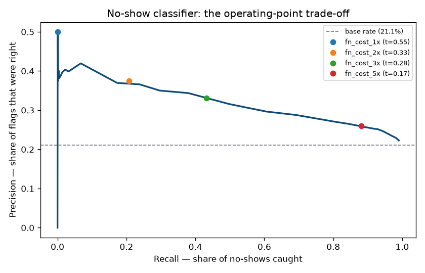
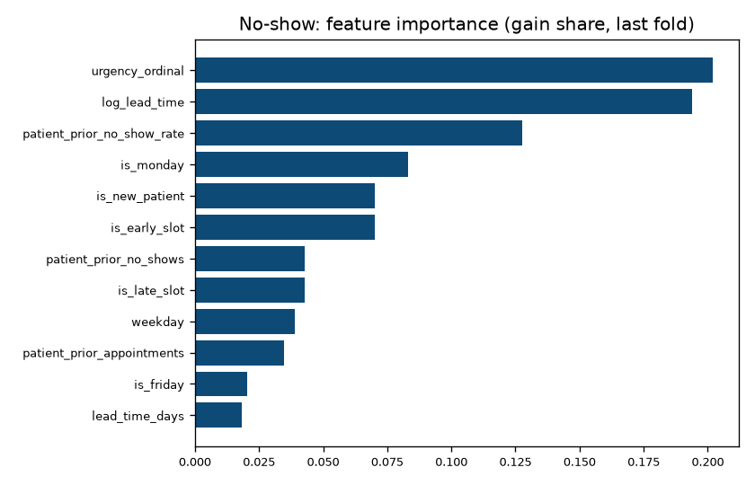
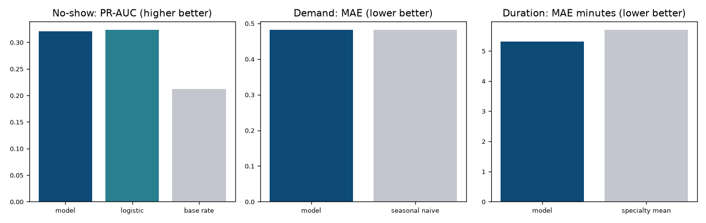

# Phase 3 — Forecasting

> **Goal:** three models — no-show, demand, duration — with an eval harness that
> is a *gate*, not a report.
>
> **The finding that shaped the phase:** two of the three models lost to their
> baselines, and the honest response was to ship the simpler estimator rather
> than tune until the complicated one won.

---

## Table of contents

1. [The prediction point](#1-the-prediction-point)
2. [Leakage: three ways to get it wrong](#2-leakage-three-ways-to-get-it-wrong)
3. [Splitting a time series](#3-splitting-a-time-series)
4. [The missing zeros](#4-the-missing-zeros)
5. [Baselines, and why they are the point](#5-baselines-and-why-they-are-the-point)
6. [Choosing an operating point](#6-choosing-an-operating-point)
7. [Calibration](#7-calibration)
8. [Model selection done honestly](#8-model-selection-done-honestly)
9. [Purity, and where the database lives](#9-purity-and-where-the-database-lives)
10. [Serving](#10-serving)
11. [The fairness constraint](#11-the-fairness-constraint)
12. [Results](#12-results)

---

## 1. The prediction point

Before any modelling, one question decides which features are legal:
**when is the prediction made?**

The answer here is **at booking time**. Every feature must be knowable the
moment a slot is claimed. That constraint costs accuracy — a booking made 60
days out ignores the 59 days of patient history since — and buys the thing that
makes the model useful: the optimizer schedules weeks ahead, so a prediction
that only exists 24 hours before the appointment cannot inform it.

The alternative (predict the night before) is more accurate and answers a
different question: "who is likely to miss tomorrow?" That is a reminder-targeting
model, not a scheduling one.

Stating this up front is what makes the leakage rules in §2 checkable. Without a
prediction point, "is this feature legal?" has no answer.

---

## 2. Leakage: three ways to get it wrong

Phase 1 deliberately gave every patient a latent no-show propensity, so their
history genuinely predicts their future. That makes patient history the most
valuable feature in the dataset **and** the most dangerous.

### Leak 1 — the row's own label

```python
df["rate"] = df.groupby("patient_id")["no_show"].transform("mean")
```

The mean includes the row's own outcome. A model fed this reports excellent
metrics and is worthless, because at prediction time the column cannot exist.

### Leak 2 — future appointments

The same expression also includes every *later* appointment. Even excluding the
row itself, a January appointment would be scored using June's outcome.

### Leak 3 — the subtle one: booked earlier, not yet attended

```python
prior = appointments[appointments.booked_at < row.booked_at]   # still wrong
```

An appointment booked on 1 January for 1 June has **no outcome** on 1 February.
Counting it as known history imports information from four months in the future.

**The correct condition** is that the prior appointment must already have
*happened*:

```python
prior.appointment_date < row.booked_at.date()
```

`features._patient_history` implements exactly that: each patient's resolved
outcomes are sorted once, cumulative sums taken, and `searchsorted` finds how
many predate each booking. `tests/unit/test_no_leakage.py` asserts it directly —
including a case built specifically to catch Leak 3.

### Leak 4 — the one that survives a correct split

`base_rate` is used to smooth sparse patient history toward the clinic average.
Computing it from the frame being scored folds that frame's own label
distribution into its features. So it is a parameter, computed on training rows
and injected into the test transform:

```python
base_rate = float((resolved_train["status"] == "no_show").mean())
X_test, y_test = features.build_no_show_features(test_raw, base_rate=base_rate)
```

This is the leak a temporal split does *not* catch, which is why it gets its own
test.

### Concept: empirical-Bayes shrinkage

A patient who missed their only appointment is not a 100% risk. The history rate
is shrunk toward the clinic base rate:

```
rate = (no_shows + k * base_rate) / (count + k)      # k = 5
```

With one miss that reads ~0.33 rather than 1.0, and converges to the patient's
true rate as evidence accumulates. Without it the model would treat a single
data point as certainty.

---

## 3. Splitting a time series

### Concept: why a random split is not merely suboptimal, but wrong

Appointments are ordered in time. A random split puts later appointments in
training and earlier ones in test, so the model is scored on predicting a past
whose future it has already seen. **Reported accuracy goes up while real
accuracy goes down** — the worst possible combination, because the number
improves as the model gets less useful.

### Concept: rolling origin

Four folds, each training on everything before a cutoff and testing after it:

```
fold 1  train 2023-09 .. 2025-09  test 2025-09-26 .. 2025-12-24
fold 2  train 2023-09 .. 2025-12  test 2025-12-25 .. 2026-03-24
fold 3  train 2023-09 .. 2026-03  test 2026-03-25 .. 2026-06-22
fold 4  train 2023-09 .. 2026-06  test 2026-06-23 .. 2026-09-20
```

The window expands, never shuffles, never reaches past its cutoff. The payoff is
a **mean and a spread**: a metric that swings between folds is a lucky cutoff,
and a single holdout would report it as a result.

`assert_no_temporal_leakage` is called on every fold, and there is a test
asserting the detector itself fires on a deliberately shuffled split — a guard
that never fails is decoration.

`rolling_origin_folds` **raises** rather than silently returning fewer folds when
the data cannot support the request. Quietly returning three folds would make a
reported "mean of four" a lie.

---

## 4. The missing zeros

The demand target is a count per `(specialty, date, hour)` cell. Grouping the
appointment table gives **22,636** cells. The full grid is 5 × 1,110 × 11 ≈
**61,105**.

The ~38,000 missing cells are the ones with *zero* appointments — Sunday
mornings, late evenings, quiet specialties. Train on only the populated cells and
the model never observes a quiet hour, so it learns demand is always at least
one and systematically over-predicts exactly the slots a scheduler most wants to
know are empty.

```python
grid = full_index.merge(observed, how="left")
grid["count"] = grid["count"].fillna(0)     # 66% of the grid
```

This is a bug that produces a *plausible* model. Nothing errors; the predictions
are simply wrong in one direction, everywhere it matters.

### Concept: Poisson, not squared error

The target is a count of arrivals in a fixed interval — non-negative, integer,
variance growing with the mean. Squared error assumes constant-variance
symmetric noise, under-weights errors on busy hours, and will happily predict
−0.3 appointments. The objective is `poisson`, and predictions are clipped at
zero because "unlikely" is not "impossible".

---

## 5. Baselines, and why they are the point

A metric with nothing to compare against is unfalsifiable. "ROC-AUC 0.66" sounds
respectable until you learn a logistic regression scores 0.66 too.

| Model | Baseline | Why that baseline |
|---|---|---|
| No-show | base rate; logistic regression | the floor, and the thing a competent person tries first |
| Demand | (specialty, weekday, hour) mean | what a scheduler already knows |
| Duration | specialty mean | one standard slot length — current practice |

These are deliberately **hard** baselines. The no-show data was generated from a
logistic model, so logistic regression is *correctly specified* for it. The
demand data is essentially a weekday-by-hour profile, so the profile average is
close to the true generating process.

Picking easy baselines is the commonest way to make a model look good, and it is
self-deception: the comparison is the result.

---

## 6. Choosing an operating point

The classifier outputs a probability. Turning it into a decision needs a
threshold, and 0.5 is not a neutral choice — it is the threshold you get by not
choosing one.

The two errors are not symmetric:

- **False negative** — a no-show nobody flagged. The slot is wasted: a doctor
  idles and a patient who wanted that time did not get it.
- **False positive** — a patient flagged who then attends. If that drove an
  overbooking, two people now want one slot and someone waits.

Which is worse is *clinic policy*, not a modelling fact, so it is an explicit
parameter. The harness reports four cost ratios:

| FN cost | threshold | precision | recall | F1 |
|---|---|---|---|---|
| 1× | 0.55 | 0.500 | 0.001 | 0.001 |
| 2× | 0.33 | 0.374 | 0.207 | 0.267 |
| 3× | 0.28 | 0.331 | 0.433 | 0.375 |
| 5× | 0.17 | 0.260 | 0.881 | 0.402 |

**Read the 1× row.** At equal costs the optimal policy is to flag almost nothing.
That is not a bug — with a 22% base rate and a modestly discriminative model,
predicting "attends" for everyone genuinely minimises misclassification cost. It
is the honest answer to "should we act on this at 1:1?", and it is *no*.

The model becomes actionable only when a missed no-show is judged ≥3× costlier
than an over-booked slot. Shipping the 2× threshold without showing that row
would hide the most important thing the analysis found.



---

## 7. Calibration

### Concept: ranking is not probability

A model can order cases perfectly and still output probabilities that are
uniformly far too high. ROC-AUC cannot tell the difference; **Brier score** can.

This matters concretely. The optimizer does not just want "flag the risky ones" —
it wants an *expected number of no-shows* for a session, which means summing
probabilities. Summing uncalibrated scores produces a number with no meaning.

So predictions go through `CalibratedClassifierCV` with isotonic regression
(fitted on folds of the *training* data only), and Brier is reported alongside
AUC. `test_brier_rewards_calibration_not_just_ranking` pins the distinction with
two models that have identical AUC and very different honesty.

**Class weighting is deliberately left at default.** `scale_pos_weight` would
inflate predicted probabilities away from the true rate — spending the
calibration just paid for to achieve a threshold shift that is better expressed
directly as a threshold.

---

## 8. Model selection done honestly

Two of three models lost to their baselines. What happened next is the part worth
reading.

### No-show: logistic regression beat gradient boosting

| | PR-AUC | ROC-AUC | Brier |
|---|---|---|---|
| LightGBM | 0.301 | 0.644 | 0.1602 |
| Logistic regression | **0.323** | **0.664** | **0.1576** |

Not a fluke to be tuned away. The no-show process *is* a logistic function of the
features, so a linear model in log-odds space is correctly specified and boosting
is approximating it with step functions. Adding capacity would fit noise.

### Demand: the profile average matched the model

| | MAE | RMSE |
|---|---|---|
| LightGBM | 0.4822 | **0.7298** |
| Seasonal-naive profile | **0.4817** | 0.7337 |

A tie on MAE, model marginally ahead on RMSE. The generator's demand is a
weekday-by-hour profile times a mild seasonal factor — the baseline is nearly the
true model.

### The wrong ways to respond

- **Report RMSE instead of MAE.** Metric shopping. The metric was chosen before
  the results.
- **Tune until the boosted model wins.** Overfitting the evaluation, one
  hyperparameter at a time.
- **Quietly report only the boosted number.** The comparison is the result.

### What was actually done

Both models now **select between candidates on training data**, using
`TimeSeriesSplit` — never on the evaluation folds, because choosing by test score
is a slower way of overfitting the test set.

```
no-show   TimeSeriesSplit AP: logistic 0.3567 | boosting 0.3219  -> logistic
demand    TimeSeriesSplit MAE: profile 0.4801 | boosting 0.4842  -> profile
```

**When the simple estimator wins, the simple estimator ships.** The demand
"model" is the profile average on all four folds, and the harness prints exactly
that so a tie cannot be misread as a win:

```
[PASS] demand is at least as good as the seasonal-naive profile:
       MAE 0.4817 vs naive 0.4817; selected [profile]
       (selection chose the profile: the simple estimator IS the baseline here)
```

One honest caveat about process: an intermediate run showed demand MAE 0.4601,
which looked like a win. It was not reproducible against the final code, so it is
not reported. Only numbers regenerable from the committed code appear here — the
evaluation was run twice to confirm determinism before anything was written down.

### One genuine improvement

The demand model was given the profile **as a feature** (leakage-safely, fitted
on training rows and injected into the test transform). That is not metric
shopping — it is the standard move of handing the model the strong baseline so it
can only add to it. It narrowed the gap; it did not close it, and selection still
prefers the profile.

---

## 9. Purity, and where the database lives

`forecasting/` may not import SQLAlchemy, FastAPI, or `app.*` — enforced by
`scripts/check_purity.py` in CI since Phase 0. So the boundary is explicit:

```
app/services/ml_data_service.py     DB  ->  DataFrame      (impure)
forecasting/*                       DataFrame -> model     (pure)
app/services/inference_service.py   DB + model -> answer   (impure)
```

The payoff is concrete: every model test in `tests/unit/` runs in milliseconds
with no database, and the same feature code can be called from a script, a
notebook, or a Celery task.

### Concept: training/serving skew

The most valuable consequence is that serving calls `forecasting.features` rather
than reimplementing the transformations. If serving computed `log_lead_time`
itself and rounded differently, the model would receive subtly different numbers
than it learned on. Nothing errors. Predictions just quietly degrade, in a way
that looks like the model simply being bad.

---

## 10. Serving

Artifacts load once per process behind an `lru_cache`. Each is written with a
**model card**: seed, git sha, feature list, training rows, date range,
hyperparameters, metrics, and — for the classifier — the threshold *and its
rationale*.

The card is not documentation, it is operational. Serving reads the threshold
from it rather than hardcoding one, so the operating point in production is
provably the one the metrics were reported at, and retraining under a different
cost policy takes effect without a code change.

**Missing artifacts degrade rather than crash.** A fresh checkout where nobody
has run `train_models.py` still boots; prediction endpoints return 503 with an
actionable message. Duration goes further and falls back to a default, because
the optimizer always needs *a* number and an error is less useful than 30
minutes.

---

## 11. The fairness constraint

**Patients cannot read no-show predictions — including their own.** Every
prediction route requires admin or doctor.

Two reasons, and neither is about permissions in the usual sense:

- Telling someone the system expects them to miss their appointment is not
  neutral information. It is a nudge, and plausibly a self-fulfilling one.
- The score is driven partly by that patient's own history, so surfacing it turns
  a statistical estimate into something that reads as an accusation.

The patient dashboard shows factual attendance history and nothing predictive.
`test_patient_cannot_read_a_no_show_prediction` exists so this decision cannot
erode in a refactor — an undocumented product decision with no test is one commit
from disappearing.

---

## 12. Results

All figures from `scripts/evaluate.py`, rolling-origin, 4 folds × 90-day test
windows, 31,352 resolved appointments. Committed to
`backend/reports/metrics/metrics.json`.

### No-show classifier

| | PR-AUC | ROC-AUC | Brier |
|---|---|---|---|
| **Model** (logistic, calibrated) | **0.320 ± 0.019** | **0.663** | **0.1578** |
| Logistic regression | 0.323 ± 0.019 | 0.664 | 0.1576 |
| Base rate | 0.212 ± 0.009 | 0.500 | 0.1671 |

**1.51× the base rate on PR-AUC.** The ceiling is low by construction: the
outcome is a Bernoulli draw, so much of the variance is irreducible.

Feature importance recovers the generator's structure in the right order —
`log_lead_time`, `urgency`, `is_monday`, `is_new_patient`,
`patient_prior_no_show_rate`, `is_early_slot` — which is the strongest evidence
that the pipeline is correct end to end.



### Demand

| | MAE | RMSE | bias |
|---|---|---|---|
| **Model** (profile, selected 4/4 folds) | **0.4817 ± 0.0165** | 0.7337 | −0.012 |
| Seasonal-naive profile | 0.4817 | 0.7337 | — |

Identical, because selection chose the baseline. Reported as a tie, not a win.

### Duration

| | MAE (min) | RMSE (min) |
|---|---|---|
| **Model** (LightGBM, L1) | **5.305 ± 0.050** | 7.486 |
| Specialty mean | 5.696 | 7.433 |

**6.9% better MAE** — the one model that clearly earned its place. It is also the
one with the most headroom: the generator varies duration by specialty *and* by
new-vs-returning patient, and the specialty mean can only capture the first.



### Verification

| Check | Result |
|---|---|
| Tests | **144 passed** (was 98) — 16 leakage, 17 model, 13 prediction API |
| ruff / black / mypy / purity | clean, 66 source files |
| Evaluation determinism | two consecutive runs, identical to 4 decimal places |
| Gate | 5/5 checks, fails CI on regression |
| Live inference | 40-day routine 08:00 → **0.857**; next-day emergency 11:00 → **0.101** |
| Dermatology demand shape | rises 0.03 (08:00) → 0.26 (18:00), the Phase 1 evening peak |
| New-patient duration | cardiology 41.9 min = 35 base + new-patient premium |

---

## What Phase 4 builds on this

The optimizer needs exactly what this phase produces:

1. **Duration** — how long to allocate, per appointment rather than per specialty
2. **No-show probability** — calibrated, so expected attendance can be *summed*
   over a session for overbooking decisions
3. **Demand** — where capacity will be tight, per specialty and hour

One thing to carry forward: the no-show model is only actionable at a cost ratio
of 3× or higher. The optimizer should consume the **probability**, not the binary
flag — the threshold exists for human-facing decisions, and a solver can use the
full distribution rather than a thresholded version of it.
